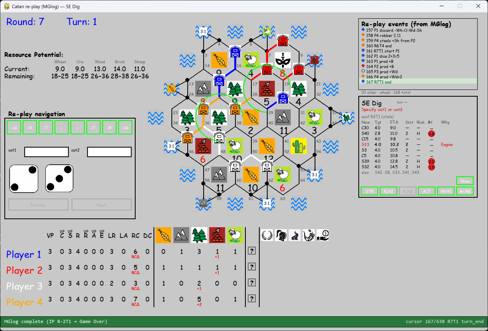

# Catan Game Project (Gen3 v037)

Python/Pygame implementation of a **Catan-style board game**, developed as an educational AI and game-engine project.

**Repository:** https://github.com/avtnl/Catan_Gen3_v037

> Not affiliated with official Catan products.

**Gen3 v037** continues from the **v035** end state (published as [Catan_Gen3_v035](https://github.com/avtnl/Catan_Gen3_v035)). The playable base from Technical Overview **v6** is still here; v037 adds lab batching, Strategy-Engine quality/performance, Replay, and several geometry/belief façades.

| Doc (published in this repo) | Role |
|------------------------------|------|
| **[MANUAL.md](MANUAL.md)** | Flags, seats, headless / Replay / lab recipes |
| **[Overview_v037_added_functionality_take2.md](docs/Overview_v037_added_functionality_take2.md)** | What changed in the v037 cycle |
| **[Overview modules v037_v3.docx](docs/Overview%20modules%20v037_v3.docx)** | Module map by product mode (GUI / headless / Replay / probes) |
| *The 102 / 143 ways to win* (Parts I–III) + Expected-Hand paper | Strategy inspiration sources under `docs/` |
| [`docs/screenshot.png`](docs/screenshot.png) | README hero shot (gameplay) |

---

## What you can run

| Entry | Role |
|-------|------|
| **`main.py`** | Interactive mixed human/AI game (default: human White / P3) |
| **`run_headless.py`** | All-AI lab batches (no play window; needs `NO_GUI_AT_ALL_TF=True`) |
| **`replay_catan_game.py`** | Step a finished game from playboard + MGlog (**no** Strategy-Engine re-plan) |

Flip `NO_GUI_AT_ALL_TF` in `core/constants.py` when switching interactive ↔ headless / Replay GUI. Details: **[MANUAL.md](MANUAL.md)**.

This project covers most base-set Catan features and is playable. It is **not** a finished commercial product; educational / experimental under MIT.

---

## Features (playable base)

- Hexagonal board (19 land + 26 sea tiles)
- Dynamic scoreboard and action buttons; events feed
- Board Settings: random playboards, load/edit, **CIBI** balance metrics
- Code split: `core/` (rules / AI / strategy) and `gui/` (Pygame UI)

### Initial Placement

- Interactive human placement with visual guidance
- AI algorithms: Max Pips, Max Pips + Ports, weighted strategic styles, Markov-style evaluator (inspired by Lauren Nagel’s work)

### Execution

- Human and AI turns; Trade with Bank / Trade with Player
- Build road / settlement / city; buy and play development cards
- Robber / discard / steal flows
- Mid-game **Saved_Game** load at boot; Game Over + statistics
- **Strategy-Engine** guidance for AI (Victory-Ways, sticky targets, Expected-Hand timing, Best-Action)

---

## How the AI decides (Strategy-Engine)

The AI follows a long-term plan chosen from ~**142 Victory-Ways** to ~10 VP (cities + army, expand + road, …), using a requirements table inspired by Player One’s *102/143 Ways to Win* series.

For the plan it picks, it looks at the live board (open tips, roads, races) and estimates how many **own turns** that plan might take (**Turns-Estimator** / Expected-Hand).

It **sticks** to a concrete next target (e.g. directed road path toward a settle tip) so it does not flip plans every click. Paths keep **direction** (network → tip, e.g. `[15,14]` then `[14,13]`); undirected **road_ids** (`[14,15]`) are for ownership / legal sets only.

It does a fuller rethink when something important changes (blocked tip, LA/LR shock, target finished, …). Hand-only changes usually update timing without a full re-plan.

**v037 product defaults (high level):** AI seats use scheduled way reassess (`explicit_142_recalc` style `[2,[4,4]]`); humans typically `[0]`. Check-Mode / dig chrome stay off for fair play (`CHECK_MODE=False`).

---

## What v037 adds (lab + SE quality)

See **[Overview take 2](docs/Overview_v037_added_functionality_take2.md)** for the full addendum. In short:

| Theme | Plain English |
|-------|----------------|
| **Headless batches** | Run N all-AI games; `batch_runs/…` results locally (gitignored) |
| **Refresh policy** | Heavy L2 / EH work when the *plan* needs it—not on every card draw |
| **CS / way-reassess probes** | Offline analyzers over strategy samples; matched dice labs |
| **LA/LR give-up & salvage** | Abandon dead specials; escape + partial Victory-Way salvage (flagged) |
| **MGlog + Replay** | Event CSV per game; `replay_catan_game.py` steps without re-planning |
| **Sidestep / S142** | Research timing / way-pick arms; product drive default **off** |
| **L2 sync-first / adaptive K** | Prefer board-fit before spending scarce top-K slots |
| **Opponent RCard memory** | Limited public belief window (`RCARD_MEMORY_OPPONENTS`) |
| **Way resource need** | Shared mid-game RCard residual façade (`way_resource_need`) |
| **Reachability maps** | Per-seat `path_map` / distances (`REACHABILITY_MAPS`; Gen2-style) |

Architecture layers must not blur: **core mutations** → **scan** → **strategy** → **GUI / Replay**.

---

## Project layout (published)

```text
main.py                 # Interactive pygame entry
run_headless.py         # Lab: multi-game batch
replay_catan_game.py    # Re-play / dig GUI (root entry)
core/                   # Rules, AI, strategy, TwP, batch, MGlog, …
gui/                    # Pygame UI + Replay painters/panels
assets/                 # Images & sounds
catan_142_ways_…csv     # Victory-Way requirements table
MANUAL.md               # Operator flags & recipes
docs/                   # Published allowlist only (see table above)
README.md / LICENSE
```

**Local-only (gitignored — not on GitHub):** `scripts/` (lab CLIs), `AGENTS.md`, `tests/`, `batch_runs/`, most other `docs/` plans, `Playboard_*` dumps (except `PlayBoard 08_Apr_2026_13_33_06.txt`), `_ref_Catan_Gen2_v045/`, logs (`TO_*`, `Catan*`, …).

---

## Requirements

- **Python 3.10+** (3.12 or **3.13** recommended)
- **pygame**

Optional locally: `pytest` (tests are gitignored in this publish layout).

## Install & run

```bash
git clone https://github.com/avtnl/Catan_Gen3_v037.git
cd Catan_Gen3_v037

python -m venv venv
# Windows:
venv\Scripts\activate
# macOS/Linux:
# source venv/bin/activate

pip install pygame
py -3.13 main.py
```

Focus the **game window** (not only the terminal) so keyboard shortcuts work.

### Headless / Replay (see MANUAL)

```bash
# Lab batch (set NO_GUI_AT_ALL_TF=True first)
py -3.13 run_headless.py --games 3 --batch-dir batch_runs/my_smoke

# Re-play a finished game (set NO_GUI_AT_ALL_TF=False)
py -3.13 replay_catan_game.py --game-dir batch_runs/<run>/g001
py -3.13 replay_catan_game.py --dig --game-dir batch_runs/<run>/g001
```

---

## Configuration

Tunable flags: [`core/constants.py`](core/constants.py) (load save/map, human seats, victory points, `CHECK_MODE`, `REACHABILITY_MAPS`, `RCARD_MEMORY_OPPONENTS`, `NO_GUI_AT_ALL_TF`, …).

Seats and Initial Placement algorithm ids: `Game._initialize_players()` in [`core/game.py`](core/game.py).

**Full explanations:** **[MANUAL.md](MANUAL.md)**.

| Goal | Setting |
|------|---------|
| Normal new game | `LOAD_GAME = False` |
| Resume a save | `LOAD_GAME = True` + `SAVED_GAME = "…"` |
| Fair play UI | `CHECK_MODE = False` |
| Human on White (seat 3) | `HUMAN_PLAYER = True`, `HP_ID = [3]` |
| Headless lab | `NO_GUI_AT_ALL_TF = True`, `HUMAN_PLAYER = False` |

Restart after changing constants or `_initialize_players()`.

### Useful controls

| Input | Role |
|--------|------|
| Mouse | Board, buttons, TwB / TwP / DCard / discard |
| **F9** / **F8** | Phase0 AI baseline capture (dig / Check-Mode workflows) |

With `CHECK_MODE=False` you only need the mouse for normal play. Saves: `saved_games/`; Phase0 dig dumps: `saved_phase0_files/` (local).

---

## Tools

Developed with help from AI coding assistants (ChatGPT early; **xAI Grok** later). Runtime: **Python** + **Pygame**.

---

## Acknowledgements and external inspiration

Educational project; builds on several sources of inspiration.

**Lauren Nagel** — *Analysis of “The Settlers of Catan” Using Markov Chains* — inspired Markov-style evaluation adapted for Initial Placement in this Python/Pygame codebase.

**Player One** (BoardGameAnalysis.com) — *The 102/143 Ways to Win at Catan* (Parts I–III) and *What is a balanced Catan board* (CIBI). Gen3 uses a **142-way** requirements table and CIBI-style board balance ideas. Published copies of the ways papers (and the Expected-Hand feasibility paper) live under `docs/` in this repo.

The implementation here is an independent educational adaptation—not copied code from those works, and **not** an official Catan product.

---

## License

MIT — see [LICENSE](LICENSE).  
Copyright (c) 2026 Anthony van Tilburg.

## Disclaimer

This is an independent educational project inspired by the rules of Catan.  
It is **not** an official product of Catan GmbH / Kosmos / Asmodee.
